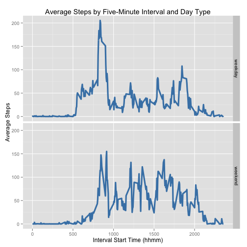

# Reproducible Research: Peer Assessment 1

This report is my submission for Assignment One of the Coursera Reproducible
Research course.

## Preparation
Before working with the data, I load the ggplot2 library, and define a
simple function to enable nice formatting for R values printed inline.


```r
# load ggplot2
require(ggplot2)
```

```
## Loading required package: ggplot2
```

```r
# define value formatting function
val_fmt <- function(val) {
    if (val%%1 == 0) {
        format(val, big.mark = ",")
    } else {
        format(round(val, 1), nsmall = 1, big.mark = ",")
    }
}
```


## Loading and preprocessing the data

First, I read the data into an R data frame, ```activities```.


```r
# read raw data into data frame
colClasses <- c("integer", "Date", "integer")
activities <- read.table("activity.csv", header = T, sep = ",", colClasses = colClasses)
```


Next, I create a daily summary data frame, ```daily_summary```...


```r
# create daily summary data frame
daily_summary <- aggregate(steps ~ date, data = activities, sum, na.rm = F, 
    na.action = na.pass)
```


...followed by an interval summary data frame, ```interval_sumary```.


```r
# create interval summary data frame
interval_summary <- aggregate(steps ~ interval, data = activities, mean, na.rm = T, 
    na.action = na.pass)
names(interval_summary) <- c("interval", "average_steps")
```


## What is the mean total number of steps taken per day?

I create a histogram of daily steps from the ```daily_summary``` data frame
using ggplot2.


```r
# create histogram
g <- ggplot(daily_summary, aes(steps))
g + geom_histogram(binwidth = 1000, color = "darkgray", fill = "steelblue") + 
    labs(title = "Histogram of Daily Steps", x = "Daily Steps", y = "Count of Days")
```

 


I then calculate the mean and median daily steps, ignoring missing data.


```r
# calculate mean steps per day
mean_steps <- mean(daily_summary$steps, na.rm = T)

# calculate median steps per day
median_steps <- median(daily_summary$steps, na.rm = T)
```


The mean value of daily steps is **10,766.2**, and the median
value of daily steps is **10,765**.

## What is the average daily activity pattern?

In order to examine the average daily activity pattern, I create a time-series
plot of the average number of steps taken in each five-minute interval from the
```interval_summary``` data frame using ggplot2.


```r
# create time-series plot of five-minute interval vs. average steps
g <- ggplot(interval_summary, aes(x = interval, y = average_steps))
g + geom_line(color = "steelblue", size = 1.5) + labs(title = "Average Steps by Five-Minute Interval", 
    x = "Interval Start Time (hhmm)", y = "Average Steps")
```

 


I then find the maximum average step value, and the corresponding interval.


```r
# calculate max_steps and find corresponding interval
max_interval_steps <- max(interval_summary$average_steps)
max_interval <- interval_summary[interval_summary$average_steps == max_interval_steps, 
    ]$interval
```


The maximum value of average steps (**206.2**) occurs
in the  interval beginning at **835**.

## Imputing missing values

I first calculate and report the number of missing step values.


```r
# calculate missing value count
missing_count = nrow(activities[!complete.cases(activities), ])
```


There are **2,304** missing step values in the data set.

Since data tends to be missing for large periods of time (often full days),
rather than scattered single intervals, I replace missing values with the
median value across the full data set for the corresponding interval and save
as a new data set ```activities_imp```. This involves first creating a data
frame containing the median step values for each interval,
```interval_median```, merging it with the ```activities``` data frame,
then filling missing step values with values from the new median_steps column.


```r
# fill missing values and create updated dataset
interval_median <- aggregate(steps ~ interval, data = activities, median, na.rm = T, 
    na.action = na.pass)
names(interval_median) <- c("interval", "median_steps")
activities_imp <- merge(activities, interval_median, by = "interval")
activities_imp <- activities_imp[order(activities_imp$date, activities_imp$interval), 
    ]
activities_imp[is.na(activities_imp$steps), ]$steps <- activities_imp[is.na(activities_imp$steps), 
    ]$median_steps
activities_imp$median_steps <- NULL
```


I then create a daily summary data frame, ```daily_summary_imp``` (similar to
the one created earlier from the ```activities``` data frame) from the
```activities_imp``` data frame, and create a histogram of daily steps using
ggplot2.


```r
# create daily summary data frame
daily_summary_imp <- aggregate(steps ~ date, data = activities_imp, sum, na.rm = F, 
    na.action = na.pass)
names(daily_summary_imp) <- c("date", "steps")

# create histogram of daily steps
g <- ggplot(daily_summary_imp, aes(steps))
g + geom_histogram(binwidth = 1000, color = "darkgray", fill = "steelblue") + 
    labs(title = "Histogram of Daily Steps", x = "Daily Steps", y = "Count of Days")
```

 


Finally, I calculate the mean and median daily steps, including imputed step
counts.


```r
# calculate mean steps per day
mean_steps_imp <- mean(daily_summary_imp$steps, na.rm = T)

# calculate median steps per day
median_steps_imp <- median(daily_summary_imp$steps, na.rm = T)
```


The mean value of daily steps including imputed step counts is
**9,503.9**, and the median value is
**10,395**. Both of these values are lower than the
corresponding values excluding missing data (**10,766.2** and
**10,765**, respectively). This is due to the combination of
my imputation method, which assigns the median interval value to intervals with
missing step counts, and the fact that the missing data comprises exactly eight
full days. For each of these eight days, imputation results in a step count of
**1,141**, which can be seen in the
histogram above. Cleary, adding eight days at this relatively low step count
results in decreases in the mean and median daily steps, and suggests that
imputing missing values from median *daily* step counts might be more reasonable
in cases where full days of data are missing.

## Are there differences in activity patterns between weekdays and weekends?

In order to examine differences in activity patterns between weekdays and
weekends, I first create a new factor variable, ```daytype```, which takes on
a value of either *weekday* or *weekend*.


```r
# add daytype factor variable
activities_imp$daytype <- factor(substr(weekdays(activities_imp$date), 1, 1) == 
    "S", labels = c("weekday", "weekend"))
```


I then create an interval summary data frame, ```interval_summary_imp```
(similar to the one created earlier from the ```activities``` data frame) from
the ```activities_imp``` data frame, and create a panel plot of weekday and
weekend activity using ggplot2.


```r
# create interval summary data frame
interval_summary_imp <- aggregate(steps ~ interval + daytype, data = activities_imp, 
    mean, na.rm = T, na.action = na.pass)
names(interval_summary_imp) <- c("interval", "daytype", "average_steps")

# create panel plot
g <- ggplot(interval_summary_imp, aes(x = interval, y = average_steps))
g + geom_line(color = "steelblue", size = 1.5) + facet_grid(daytype ~ .) + labs(title = "Average Steps by Five-Minute Interval and Daytype", 
    x = "Interval Start Time (hhmm)", y = "Average Steps")
```

 


The panel plot shows that on weekdays, the subject is generally
active earlier and more sedentary during the day and evening, with the
exception of the early evening. This is consistent with what I'd expect to be
a typical activity pattern for an office worker. Also consistent with a
typical office worker is the greater weekday concentration of activity
associated with travel to work in the morning compared to weekday activity
associated with travel home from work in the evening.
